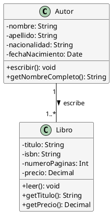

Solución: Ejercicio 1 - Sistema de Libros y Autores
===================================================

Análisis del Problema
---------------------

### Identificación de Clases

Del análisis de las especificaciones, identificamos las siguientes clases:

1.  **Autor**

    -   Clase que representa al creador de las obras.

    -   Atributos: nombre, apellido, nacionalidad, fechaNacimiento.

    -   Métodos: escribir(), getNombreCompleto().

2.  **Libro**

    -   Clase que representa la obra escrita.

    -   Atributos: titulo, isbn, numeroPaginas, precio.

    -   Métodos: leer(), getTitulo(), getPrecio().

Análisis de Relaciones
----------------------

### 1\. Asociación (Autor - Libro)

-   **Nombre**: "escribe" / "es escrito por"

-   **Tipo**: Asociación Unidireccional o Bidireccional. (Se puede modelar internamente con una lista de libros en `Autor`).

-   **Cardinalidad**:

    -   Un **Autor** escribe **uno o varios Libros** (`1..*`).

    -   Un **Libro** es escrito por **un único Autor** (`1`).

-   **Justificación**: Es una relación fundamental de **uno a muchos (1:N)**. La asociación permite que el autor y el libro existan como entidades separadas pero relacionadas.

Tabla de Roles y Cardinalidades
-------------------------------

| **Relación** | **Clase Origen** | **Rol Origen** | **Cardinalidad Origen** | **Clase Destino** | **Rol Destino** | **Cardinalidad Destino** |
| --- | --- | --- | --- | --- | --- | --- |
| Asociación | Autor | escribe | 1..* | Libro | es escrito por | 1 |

Decisiones de Diseño
--------------------

### Visibilidad y Encapsulación

Todas las propiedades son **privadas (`-`)** (`nombre`, `apellido`, etc.) para proteger el estado de la clase. Los métodos de acción y consulta son **públicos (`+`)**.

### Campo Derivado

El método `getNombreCompleto()` se define como **{derived}** para indicar que su valor se calcula (`$nombre $apellido`) y no se almacena como un atributo físico.

### Tipos de Datos

Se utiliza `Date` para la fecha de nacimiento y `Decimal` para el precio, ya que es más adecuado para representar valores monetarios.

Diagrama de Clases
------------------


Código PlantUML
---------------

Fragmento de código



Implementación en Kotlin
------------------------

Kotlin

```kotlin
/**
 * Clase que representa a un Autor
 */
class Autor(
    private val nombre: String,
    private val apellido: String,
    private val nacionalidad: String,
    private val fechaNacimiento: String // Usamos String simple para Date en este ejemplo
) {
    private val librosEscritos: MutableList<Libro> = mutableListOf()

    fun escribir()
    fun getNombreCompleto()
    fun agregarLibro()

}

/**
 * Clase que representa un Libro
 */
class Libro(
    private val titulo: String
    private val isbn: String
    private val numeroPaginas: Int
    private val precio: Double
    private val autor: Autor
) {

    fun leer()
    fun getTitulo()
    fun getPrecio()

}


```
