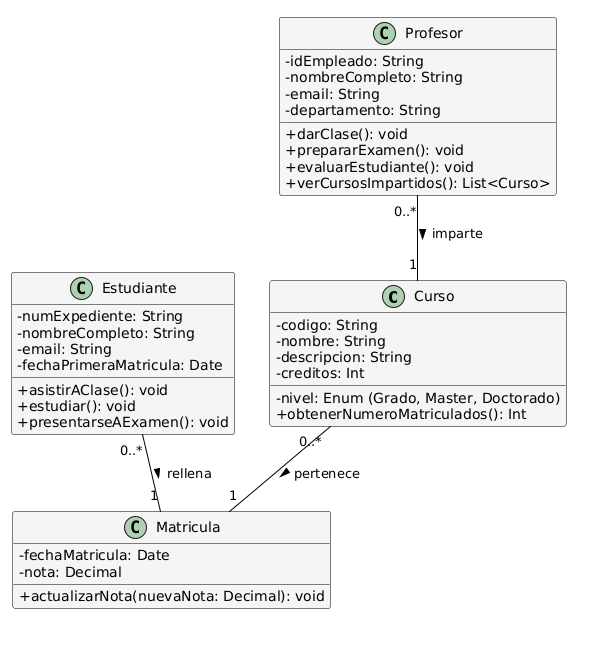
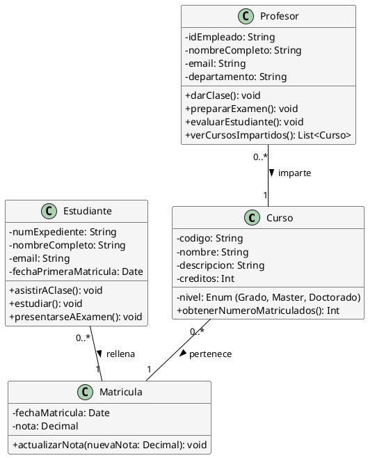

Solución: Ejercicio 2 - Sistema de Gestión de Cursos Universitarios
===================================================================

====================================================================

Análisis del Problema
---------------------

### Identificación de Clases

Del análisis de las especificaciones, identificamos las siguientes clases:

1.  **Curso**

    -   Representa la unidad académica ofrecida.

    -   Atributos: codigo, nombre, descripcion, creditos, nivel.

    -   Métodos: obtenerNumeroMatriculados().

2.  **Profesor**

    -   Representa al personal docente que imparte los cursos.

    -   Atributos: idEmpleado, nombreCompleto, email, departamento.

    -   Métodos: darClase(), prepararExamen(), evaluarEstudiante(), verCursosImpartidos().

3.  **Estudiante**

    -   Representa a los alumnos de la universidad.

    -   Atributos: numExpediente, nombreCompleto, email, fechaPrimeraMatricula.

    -   Métodos: asistirAClase(), estudiar(), presentarseAExamen().

4.  **Matricula** (Clase de Asociación)

    -   Representa el vínculo transaccional entre un `Estudiante` y un `Curso`, y almacena datos de esa transacción.

    -   Atributos: fechaMatricula, nota.

    -   Métodos: actualizarNota().

Análisis de Relaciones
----------------------

### 1\. Asociación (Curso - Profesor)

-   **Nombre**: "imparte" / "es impartido por"

-   **Tipo**: Asociación simple (uno a muchos).

-   **Cardinalidad**:

    -   Un **Curso** es impartido por **un único Profesor** (`1`).

    -   Un **Profesor** puede impartir **cero o varios Cursos** (`0..*`).

-   **Justificación**: Relación 1:N clara, donde el `Profesor` es el responsable del `Curso`.

### 2\. Clase de Asociación (Estudiante - Curso)

-   **Entidades base**: `Estudiante` y `Curso`.

-   **Clase intermedia**: `Matricula`.

-   **Cardinalidad**:

    -   Entre `Estudiante` y `Matricula`: Un **Estudiante** tiene **cero o varias Matrículas** (`0..*`). Una **Matrícula** pertenece a **un único Estudiante** (`1`).

    -   Entre `Curso` y `Matricula`: Un **Curso** tiene **cero o varias Matrículas** (`0..*`). Una **Matrícula** corresponde a **un único Curso** (`1`).

-   **Justificación**: La relación es Muchos-a-Muchos (M:N) y además necesita almacenar atributos propios (`fechaMatricula`, `nota`), lo que obliga a usar una **Clase de Asociación**.

Tabla de Roles y Cardinalidades
-------------------------------

| **Relación** | **Clase Origen** | **Rol Origen** | **Cardinalidad Origen** | **Clase Destino** | **Rol Destino** | **Cardinalidad Destino** |
| --- | --- | --- | --- | --- | --- | --- |
| Asociación | Profesor | imparte | 0..* | Curso | responsable | 1 |
| Asociación | Estudiante | tiene | 0..* | Matricula | de estudiante | 1 |
| Asociación | Curso | tiene | 0..* | Matricula | de curso | 1 |

Decisiones de Diseño
--------------------

### Clase de Asociación (`Matricula`)

La decisión más importante fue modelar `Matricula` como una Clase de Asociación. Esto es necesario porque:

1.  La relación es M:N (muchos estudiantes se matriculan en muchos cursos).

2.  La relación tiene atributos propios (`fechaMatricula`, `nota`) que no pertenecen ni al `Estudiante` ni al `Curso`.

### Visibilidad y Encapsulación

Se mantiene el estándar de **atributos privados (`-`)** y **métodos públicos (`+`)** para adherirse a los principios de la POO.

### Tipos de Datos

Se utiliza `String` para códigos únicos (ISBN, idEmpleado), `Date` para fechas y `Int` o `Decimal` para cantidades (`creditos`, `nota`).

Diagrama de Clases
------------------


Código PlantUML
---------------

Fragmento de código



Implementación en Kotlin
------------------------
Kotlin
```
/**
 * Clase que representa un Curso universitario
 */
class Curso(
    private val codigo: String,
    private val nombre: String,
    private val descripcion: String,
    private val creditos: Int,
    private val nivel: String
) {
    fun obtenerNumeroMatriculados()
}

/**
 * Clase que representa un Profesor
 */
class Profesor(
    private val idEmpleado: String,
    private val nombreCompleto: String,
    private val email: String,
    private val departamento: String
) {
    fun darClase()
    fun prepararExamen()
    fun evaluarEstudiante()
    fun verCursosImpartidos()
}

/**
 * Clase que representa un Estudiante
 */
class Estudiante(
    private val numExpediente: String,
    private val nombreCompleto: String,
    private val email: String,
    private val fechaPrimeraMatricula: String // Usamos String para Date en este ejemplo
) {
    fun asistirAClase()
    fun estudiar()
    fun presentarseAExamen()
}

/**
 * Clase que representa el registro de Matricula (Clase de Asociación)
 */
class Matricula(
    private val fechaMatricula: String,
    private var nota: Double // Usamos Double para Decimal y var para poder actualizar
) {
    fun actualizarNota(nuevaNota: Double)
}

```
