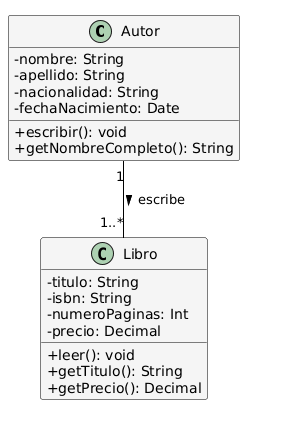

Solución: Ejercicio 4 - Sistema de Gestión Empresarial
======================================================

=========================================================

Análisis del Problema
---------------------

### Identificación de Clases

Del análisis de las especificaciones, identificamos las siguientes clases:

1.  **Persona** (Clase Abstracta/Padre)

    -   Clase base que consolida atributos comunes a `Empleado` y `Cliente`.

    -   Atributos: nombreCompleto, fechaNacimiento.

    -   Métodos: calcularEdad().

2.  **Empleado** (Hereda de Persona)

    -   Representa al personal interno.

    -   Atributos: sueldoBruto.

    -   Métodos: calcularSueldoNeto().

3.  **Cliente** (Hereda de Persona)

    -   Representa a los contactos en las empresas.

    -   Atributos: telefono.

    -   Métodos: contactar().

4.  **Empresa**

    -   Entidad corporativa con la que se mantiene la relación comercial.

    -   Atributos: nombreCorporativo, CIF, direccionFiscal.

### Identificación de Especializaciones y Patrones

-   **Especialización:** Dentro de la clase `Empleado`, la jerarquía de mando se modela con una **Asociación Reflexiva**. Sin embargo, para representar la distinción entre un empleado normal y un responsable que tiene un rango salarial diferente, se puede considerar la herencia o, de forma más simple, un atributo dentro de `Empleado` para el rol y un atributo para la categoría (Supervisor, Gerente, etc.). Aquí optaremos por la asociación reflexiva y un atributo de rol/categoría para simplificar la jerarquía.

Análisis de Relaciones
----------------------

### 1\. Generalización (Persona)

-   **Entidades base**: `Persona` (Abstracta).

-   **Especializaciones**: `Empleado` y `Cliente`.

-   **Justificación**: Ambas entidades (`Empleado` y `Cliente`) comparten el nombre completo y la fecha de nacimiento. La herencia centraliza estos datos.

### 2\. Asociación Reflexiva (Jerarquía de Empleados)

-   **Entidades base**: `Empleado`.

-   **Relación**: `Empleado` con `Empleado`.

-   **Cardinalidad**:

    -   Un **Responsable** (Empleado) tiene **cero o varios Subordinados** (`0..*`).

    -   Un **Subordinado** (Empleado) reporta a **un único Responsable** (`1`).

-   **Justificación**: Modela la estructura de "cadena de mando" donde un empleado actúa como supervisor de otros dentro de la misma clase.

### 3\. Asociación (Cliente - Empresa)

-   **Entidades base**: `Cliente` y `Empresa`.

-   **Cardinalidad**:

    -   Un **Cliente** representa **uno o varios Empresas** (`1..*`)

    -   Una **Empresa** tiene **uno o varios Clientes** (`1..*`)

-   **Justificación**: Relación Muchos-a-Muchos (M:N) con la restricción de que un cliente debe estar en al menos una empresa, y una empresa debe tener al menos un cliente de contacto.

Tabla de Roles y Cardinalidades
-------------------------------

| **Relación** | **Clase Origen** | **Rol Origen** | **Cardinalidad Origen** | **Clase Destino** | **Rol Destino** | **Cardinalidad Destino** | **Tipo** |
| --- | --- | --- | --- | --- | --- | --- | --- |
| Herencia | Persona | Padre | - | Empleado | Hijo | - | Generalización |
| Herencia | Persona | Padre | - | Cliente | Hijo | - | Generalización |
| Reflexiva | Empleado | Subordinado | 1 | Empleado | Responsable | 0..* | Asociación |
| Asociación | Cliente | Contacto | 1..* | Empresa | Asociada a | 1..* | Asociación M:N |

Decisiones de Diseño
--------------------

### Herencia (`Persona`)

Se utiliza la clase base `Persona` para evitar la duplicación de atributos como `nombreCompleto` y `fechaNacimiento` en `Empleado` y `Cliente`. El método `calcularEdad()` se define aquí como un atributo derivado.

### Asociación Reflexiva

La estructura de mando se modela con una asociación de la clase `Empleado` consigo misma. El rol `Responsable` tiene cardinalidad `0..*` y el rol `Subordinado` tiene cardinalidad `1`, asegurando que todo empleado reporta a alguien (excepto, implícitamente, el Responsable máximo que no es subordinado de nadie en la cadena).

### Atributos Derivados

-   `calcularEdad()`: Derivado de `fechaNacimiento`.

-   `calcularSueldoNeto()`: Derivado de `sueldoBruto` aplicando la retención (por defecto, 22%).

### Enumeración (`Categoria`)

Se utiliza una enumeración para modelar las diferentes categorías de `Empleado` responsable, facilitando la gestión de diferentes porcentajes de retención.

Diagrama de Clases
------------------


Código PlantUML
---------------

Fragmento de código

```
@startuml SistemaGestionEmpresarial

skinparam classAttributeIconSize 0
skinparam class {
    BackgroundColor WhiteSmoke
    BorderColor Black
    ArrowColor Black
}


abstract class Persona {
    - nombreCompleto: String
    - fechaNacimiento: Date
    + calcularEdad(): Int
}

enum Categoria {
    Supervisor
    JefeDepartamento
    Gerente
}


class Empleado {
    - sueldoBruto: Decimal
    - retencionAplicada: Decimal
    + calcularSueldoNeto(): Decimal
    + obtenerCategoria(): Categoria
}

class Cliente {
    - telefono: String
    + contactar(): void
}

class Empresa {
    - nombreCorporativo: String
    - CIF: String
    - direccionFiscal: String
}

Persona <|-- Empleado
Persona <|-- Cliente

Empleado "1" <-- "0..*" Empleado : Subordinado reporta a >
Cliente "1..*" -- "1..*" Empresa : pertenece a
Empleado "1" -- "1" Categoria : tiene

@enduml
```

Implementación en Kotlin
------------------------

Kotlin

```kotlin
/**
 * Enumeración para las categorías de los Empleados Responsables.
 */
enum class Categoria {
    SUPERVISOR,
    JEFEDEPARTAMENTO,
    GERENTE
}

/**
 * Clase abstracta padre para entidades con datos personales comunes.
 */
abstract class Persona(
    private val nombreCompleto: String
    private val fechaNacimiento: String
) {
    fun calcularEdad()
}

/**
 * Clase que representa a un Empleado.
 */
class Empleado(
    nombreCompleto: String
    fechaNacimiento: String
    private val sueldoBruto: Double,
    private val retencionAplicada: Double
    fun calcularSueldoNeto()
    fun obtenerCategoria()
)

/**
 * Clase que representa a un Cliente de las empresas asociadas.
 */
class Cliente(
    nombreCompleto: String,
    fechaNacimiento: String,
    private val telefono: String
    fun contactar()

/**
 * Clase que representa a la entidad corporativa.
 */
class Empresa(
    private val nombreCorporativo: String,
    private val CIF: String,
    private val direccionFiscal: String
    fun facturar()
)
```
