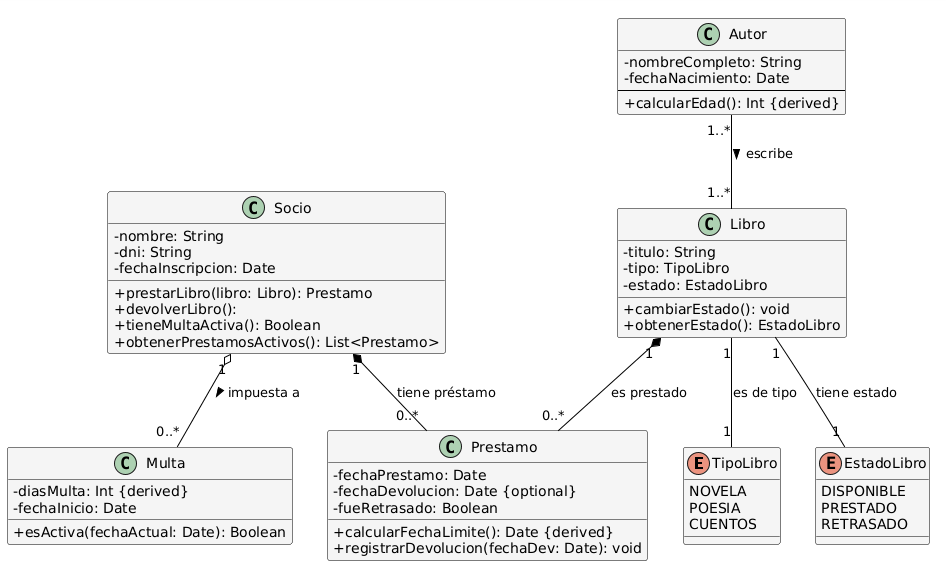
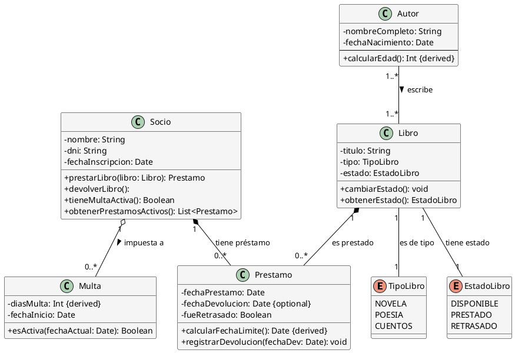

Solución: Ejercicio 6 - Sistema de Biblioteca
=============================================

Análisis del Problema
---------------------

### Identificación de Clases

Del análisis de las especificaciones, identificamos las siguientes clases y enumeraciones:

1.  **Socio**: Representa al lector.

2.  **Autor**: Creador de las obras.

3.  **Libro**: La unidad física y catalogada.

4.  **Prestamo** (Clase de Asociación): El vínculo transaccional entre un Socio y un Libro.

5.  **Multa**: Entidad separada que registra la penalización por retraso.

6.  **TipoLibro** (Enumeración): Para clasificar el género del libro.

7.  **EstadoLibro** (Enumeración): Para el estado del libro (Disponible, Prestado, Retrasado).

### Identificación de Relaciones Clave

-   **Libro - Autor**: Muchos a muchos (M:N) por la posibilidad de coautoría (aunque el enunciado no lo explicita, es una buena práctica de modelado de bibliotecas; si fuera 1:N, se modelaría como en el Ej. 1). Aquí usaremos M:N para mayor robustez.

-   **Socio - Libro**: La relación de préstamo es M:N (muchos socios toman muchos libros), y esta relación requiere atributos propios (`fechaPrestamo`, `fechaLimite`, `fechaDevolucion` potencial). Por lo tanto, se modela con la **Clase de Asociación** `Prestamo`.

-   **Socio - Multa**: Un socio puede tener varias multas históricas, y una multa pertenece a un único socio.

Análisis de Relaciones
----------------------

### 1\. Clase de Asociación (Socio - Libro)

-   **Clase intermedia**: `Prestamo`.

-   **Justificación**: Relación M:N con atributos propios (`fechaPrestamo`, `fechaLimite`). Además, la cardinalidad `0..3` en el lado del `Socio` debe ser validada por los métodos.

### 2\. Asociación M:N (Libro - Autor)

-   **Justificación**: Permite coautoría. Un libro tiene 1 o más autores, y un autor escribe 1 o más libros.

### 3\. Asociación (Socio - Multa)

-   **Justificación**: Una `Multa` es causada por un `Socio`.

Tabla de Roles y Cardinalidades
-------------------------------

| **Relación** | **Clase Origen** | **Rol Origen** | **Cardinalidad Origen** | **Clase Destino** | **Rol Destino** | **Cardinalidad Destino** | **Tipo** |
| --- | --- | --- | --- | --- | --- | --- | --- |
| Asociación | Autor | escribe | 1..* | Libro | escrito por | 1..* | M:N |
| Asociación | Socio | Prestado por | 0..* | Prestamo | De Socio | 1 | Clase Asoc. |
| Asociación | Libro | Prestado en | 0..* | Prestamo | De Libro | 1 | Clase Asoc. |
| Asociación | Socio | es multado | 0..* | Multa | por socio | 1 | 1:N |
| Usa Enum | Libro | Clasificación | 1 | TipoLibro | - | - | Tipo |
| Usa Enum | Libro | Estado Actual | 1 | EstadoLibro | - | - | Tipo |

Decisiones de Diseño
--------------------

### Atributos Derivados

-   **`Autor::calcularEdad()`**: Derivado de `fechaNacimiento`.

-   **`Prestamo::fechaLimite()`**: Derivado de `fechaPrestamo` (`+ 30 días`).

-   **`Multa::diasMulta()`**: Derivado de la comparación entre `fechaLimite` y `fechaDevolucion` (si aplica), multiplicando los días de retraso por 3.

### Reglas de Negocio (Validación)

Las reglas críticas se implementan como validaciones en los métodos del `Socio` o una clase coordinadora (aunque aquí se asignarán al `Socio` para mantener la cohesión):

-   **`Socio::prestarLibro()`**: Restricción de **{máximo 3 Préstamos activos}** y **{Socio sin Multas activas}**.

-   **`Socio::devolverLibro()`**: Activa la lógica de `Multa` si hay retraso.

### Modelado de Estados

Se utiliza la **Enumeración** `EstadoLibro` (`DISPONIBLE`, `PRESTADO`, `RETRASADO`) para el estado del `Libro`, manteniendo el atributo con un tipo estricto.

Diagrama de Clases
------------------


Código PlantUML
---------------

Fragmento de código



Implementación en Kotlin
------------------------

Kotlin

```kotlin
/**
 * Enumeración para el tipo de clasificación del Libro.
 */
enum class TipoLibro {
    NOVELA,
    POESIA,
    CUENTOS
}

/**
 * Enumeración para el estado físico de un Libro.
 */
enum class EstadoLibro {
    DISPONIBLE,
    PRESTADO,
    RETRASADO
}

/**
 * Clase que representa al creador de la obra.
 */
class Autor(
    private val nombreCompleto: String,
    private val fechaNacimiento: String
) {
    fun calcularEdad()
}

/**
 * Clase que representa la penalización por retraso.
 */
class Multa(
    private val fechaInicio: String
) {
    private var diasMulta: Int = 0 

    fun esActiva(fechaActual: String): Boolean
}

/**
 * Clase que representa al lector registrado.
 */
class Socio(
    private val nombre: String,
    private val dni: String,
    private val fechaInscripcion: String
) {
    fun prestarLibro(libro: Libro)
    fun devolverLibro(prestamo: Prestamo)
    fun tieneMultaActiva(): Boolean
    fun obtenerPrestamosActivos()
}

/**
 * Clase que representa la obra catalogada.
 */
class Libro(
    private val titulo: String,
    private val tipo: TipoLibro,
    private var estado: EstadoLibro = EstadoLibro.DISPONIBLE
) {
    fun cambiarEstado(nuevoEstado: EstadoLibro)
    fun obtenerEstado()
}

/**
 * Clase de Asociación: Registro de Préstamo.
 */
class Prestamo(
    private val fechaPrestamo: String
) {
    private var fechaDevolucion: String? = null

    fun calcularFechaLimite()
    fun registrarDevolucion(fechaDev: String)
}
```
